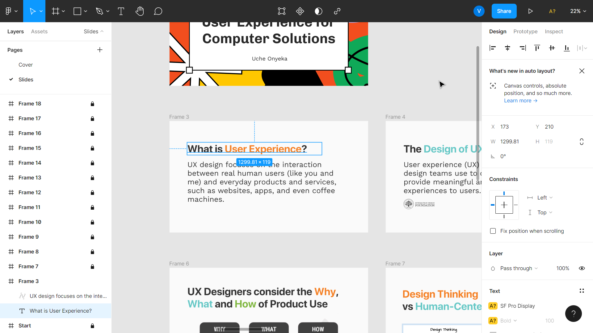

[//]: # (# Heading)

[//]: # (## Heading)

[//]: # (### Heading)

[//]: # ()
[//]: # (- List)

[//]: # (- `Code`)

[//]: # (- List)

[//]: # ()
[//]: # ()
[//]: # (```js [3])

[//]: # (const foo = 'foo';)

[//]: # (const foo = 'foo';)

[//]: # (const bar = 'bar'; // I'm highlighted)

[//]: # (```)

[//]: # ()
[//]: # ()
[//]: # (---)


# Ready

---

# Angular Flex: building with style!

*2022 / Vladyslav Yakovenko*

----

# Today 🕑

- Teach you some ideas
- Connect some well known concepts
- Teach you core ideas of `Angular Flex`
- Live build UIs with `Angular Flex`

- Abstract => Practical

----

# What will this about 📃

- Design
- Layouting
- Angular Flex
- Live building UIs

---

# Design


----

## What is Design for you? 🙋‍♂️ 🙋‍♀️

----

## What is Design (in our context) 💎

- An acceptable solution to a set of problems
<!-- .element class="fragment" -->

- A living and evolving entity
<!-- .element class="fragment" -->

- Balance between all constraints (space, usability, aesthetics, effort)
<!-- .element class="fragment" -->

- Compressed and usable version of the business process
<!-- .element class="fragment" -->

----

## What is NOT Design ⛔

- Design is not a linear process
<!-- .element class="fragment" -->

- Design is not art
<!-- .element class="fragment" -->

- Design is not following rules to the letter
<!-- .element class="fragment" -->

- Design is not still
<!-- .element class="fragment" -->

----

# Our goal 🎯


----

## How do I design (1/2) 📚

- Start from your needs and build a solution
<!-- .element class="fragment" -->

- Intentionality behind every design decision you make
<!-- .element class="fragment" -->

- There is no growth without change
<!-- .element class="fragment" -->

- Iterate constantly, a new element can break the balance
<!-- .element class="fragment" -->

----

## How do I design (2/2) 📚

- Be consistent, be cohesive
<!-- .element class="fragment" -->

- Care about your users
<!-- .element class="fragment" -->

- Learn to receive and give feedback, create a positive feedback culture
<!-- .element class="fragment" -->

- Follow rules but break them with wisdom
<!-- .element class="fragment" -->

----

## What is good design ✨

- Tension between all design constraints
<!-- .element class="fragment" -->

- Small details do matter
<!-- .element class="fragment" -->

- Space for organic growth
<!-- .element class="fragment" -->


----

## 💡 Summing up Design 

- Design is based on needs
<!-- .element class="fragment" -->

- The clearer the needs the better the problem and solution
<!-- .element class="fragment" -->

- Leave some room for future uncertainty and organic growth
<!-- .element class="fragment" -->

- Break things when negative emotions build up
<!-- .element class="fragment" -->

---

# User interfaces

----

# Layout(UI) = human-machine interface

----

# Examples of human-machine interfaces 🔬

----

## What layouting is about

- Structure
- Hierarchy of elements
- Path of use
- Communication

----

## What is your favourite app/website/program? 🙋‍♂️ 🙋‍♀️

----

# Let's analyze some popular examples 🔬

----

### Google Fonts (typography)


----

### Notion (note-taking)


----

### Finviz (market analysis)


----

### Figma (design)


----

### Postman (development)


----

### Final cut (video editing)


----


# Managing complexity 😵


----

## Common problems 🔴

- Navigation
<!-- .element class="fragment" -->

- Visual hierarchy
<!-- .element class="fragment" -->

- Data clarity
<!-- .element class="fragment" -->

- Click targets
<!-- .element class="fragment" -->

- Unpredictability
<!-- .element class="fragment" -->

----

## Tools 🔨

- Fixed anchors
<!-- .element class="fragment" -->

- Contextual elements
<!-- .element class="fragment" -->

- Hierarchy
<!-- .element class="fragment" -->

- Proximity
<!-- .element class="fragment" -->

- Weight
<!-- .element class="fragment" -->

----

## What is good layouting (1/2) 🟢

- Predictable structure
<!-- .element class="fragment" -->

- Click-Effective workflow
<!-- .element class="fragment" -->

- Visual clarity (blur test)
<!-- .element class="fragment" -->

- Easy data consumption
<!-- .element class="fragment" -->

----

## What is good layouting (2/2) 🟢

- It just makes sense
<!-- .element class="fragment" -->

- Good UX when performing a long chain of repeating actions
<!-- .element class="fragment" -->

- Muscle memory favorable
<!-- .element class="fragment" -->

----


## Extra tips on layouting 🎨

- Start with the basics (corners,body,hierarchy)
<!-- .element class="fragment" -->

- Use graphic design/usability principles
<!-- .element class="fragment" -->

- Add color only after you've used all possible black/white contrast
<!-- .element class="fragment" -->

---

# Writing HTML 👨‍💻

----

# One attribute per line has many advantages

- Better VCS
- Easier editing
- Faster visual scanning


----
🔴 DON'T 
```html

<div fxFlex [itemsName]="'Solution'" [termName1]="sol1.name!" [termName2]="sol2.name!"
     [disableExport]="(graphsReady$ | async) === false" [data]="item">
```

🟢 DO
```html

<div fxFlex
     [itemsName]="'Solution'"
     [termName1]="sol1.name!"
     [termName2]="sol2.name!"
     [disableExport]="(graphsReady$ | async) === false"
     [data]="item"
>
```

----

# Inline style makes navigation and editing faster for other people

----

🔴 DON'T 

```html
<div *ngIf="params$ | async as params"
     class="params"
>
```

🟢 DO

```html
<div *ngIf="params$ | async as params"
     style="background-color: red"
>
```

----

# Prioritize structural attributes

----

🔴 DON'T 

```html

<div [input]="thing" class="params" *ngIf="params$ | async as params"
     style="background-color: red" fxFlex [foo]="bar"
>
```

🟢 DO

```html
<div fxFlex <- layouting structure
     *ngIf="params$ | async as params" <- logic structure
     [input]="thing"  <- data
     [foo]="bar" <- data
     style="padding:2rem; background-color: red; "  <- style
>
```

----

# 💡 Summing up

- One attribute per line 
- Inline style makes navigation and editing faster for other people
- Prioritize structural attributes

---

# Angular Flex 💪


- Concise layouting engine
<!-- .element class="fragment" -->

- Powerful responsiveness manager
<!-- .element class="fragment" -->

- Abstraction of CSS flex
<!-- .element class="fragment" -->

- Integrated with `Material` and built by `@Angular` Team
<!-- .element class="fragment" -->


----

# Angular Flex vs Vanilla CSS

- Easier to learn, write and understand
<!-- .element class="fragment" -->

- Faster responsive components
<!-- .element class="fragment" -->

- Effortless state-managed layouts
<!-- .element class="fragment" -->


----

# Basics 🔑

- Layout API using `Flexbox` CSS + `mediaQuery`


----

# Dependencies 📐
#### _(already installed in our product)_

- `@angular/flex-layout`
- `@angular/cdk`

----

# What is possible
https://tburleson-layouts-demos.firebaseapp.com/#/docs

----


# How does it work?

- Everything is `Row` or `Column`
- Parents and children

----

### Simple example 1

```html

<div fxLayout="row"
>
  <div></div>
  <div></div>
  <div></div>
</div>
```

----

### Simple example 2

```html

<div fxLayout="column"
     fxLayoutGap="1rem"
>
  <div></div>
  <div></div>
  <div></div>
</div>
```

----

### Practical example

```html

<div fxFlex="14rem"
     fxLayout="column"
     fxLayoutGap="1rem"
>
  <h1>Title</h1>
  <mat-divider [inset]="true"></mat-divider>
  <app-brand-button>Create</app-brand-button>
  <div fxFlex="auto"
       fxLayout="column"
       fxLayoutGap="1rem"
  >
    <mat-card-subtitle>Recent</mat-card-subtitle>
    <mat-card-subtitle>Favorites</mat-card-subtitle>
    <mat-card-subtitle>Saved</mat-card-subtitle>
    <mat-card-subtitle>Shared with you</mat-card-subtitle>
  </div>

</div>
```

----

### Comprehensive example

```html
<div fxLayout='column' class="zero">
  
  <div fxFlex="33" [fxFlex.md]="box1Width" class="one" ></div>
  <div fxFlex="33" [fxLayout]="direction" fxLayout.md="row" class="two">
    
    <div fxFlex="22"    fxFlex.md="10px" fxHide.lg                       class="two_one"></div>
    <div fxFlex="205px" fxFlex.md="65"                                    class="two_two"></div>
    <div fxFlex="30px"  fxFlex.md="25"   fxShow [fxHide.md]="hideBox"   class="two_three"></div>
  
  </div>
  <div fxFlex class="three"></div>

</div>
```

---

# Let's build some UIs
